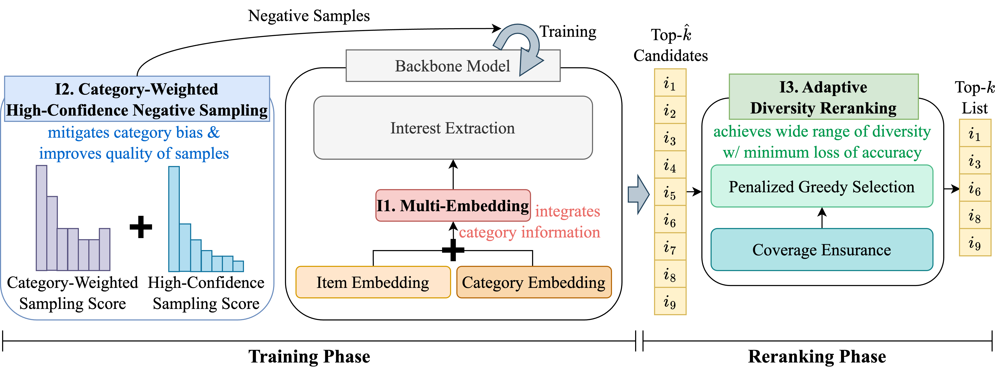

# CatDive: A Simple yet Effective Method for Maximizing Category Diversity in Sequential Recommendation


This project is a pytorch implementation of 'CatDive: A Simple yet Effective Method for Maximizing Category Diversity in Sequential Recommendation'.
CatDive achieves the state-of-the-art performance on real-world datasets, achieving up to 152.49% higher category diversity in the similar level of accuracy and up to 39.73% higher accuracy in the similar level of category diversity compared to the best competitor.
This project provides executable source code with adjustable arguments and preprocessed datasets used in the paper.

## Prerequisites

- Python 3.8+
- [PyTorch](https://pytorch.org/)
- [NumPy](https://numpy.org/)
- [tqdm](https://tqdm.github.io/)
- [pandas](https://pandas.pydata.org)

## Usage
You can run a demo script 'demo.sh' to evaluate the pretrained model of CatDive on all datasets with and without reranking.
The result looks as follows:
```
dataset: books
model: a1_b0.6
average sequence length: 118.14
user num: 8685
item num: 9053
category num: 26
100%|███████████████████| 8685/8685 [00:23<00:00, 363.01it/s]

----- TEST (N=[10,20]) ----- 

 HR:	[0.1938 0.28  ] 
 nDCG:	[0.1066 0.1284] 
 ILD:	[0.5947 0.5952] 
 cov:	[0.1213 0.1561]  


dataset: books
model: a1_b0.6
average sequence length: 118.14
user num: 8685
item num: 9053
category num: 26
100%|███████████████████| 8685/8685 [00:23<00:00, 363.01it/s]

lambda 0.1
----- TEST (N=[10,20]) ----- 

 HR:	[0.1849 0.2695] 
 nDCG:	[0.1041 0.126 ] 
 ILD:	[0.6839 0.6746] 
 cov:	[0.1562 0.2201] 
 .
 .
 .
```

You can also train the model by running 'main.py'.
There are 3 arguments you can change:
- dataset (books, kindle, gr-r)
- alpha (any number between 0 and 1)
    : alpha of Equation (?), controls multi-embedding
- beta (any number, -1 if random sampling)
    : beta of Equation (?), controls confidence in category-weighted high-confidence negative sampling

For example, you can train the model for Books dataset in 'catdive' directory with alpha of 0.5 and beta of 0.2  by following code:
```
python main.py --dataset books --dir catdive --alpha 0.5 --beta 0.2
```


You can test the model by running 'main.py' with the argument 'test' as 'True':
```
python main.py --dataset books --dir catdive --alpha 0.5 --beta 0.2 --test True
```
Make sure you put the directory excluding the name of dataset as argument 'dir'.

## Datasets
Preprocessed data are included in the data directory.
| Name | #Users | #Items | #Interactions | #Categories | Download |
| --- | ---: | ---: | ---: | ---: | :---: |
| Amazon Books (books) | 8,685 | 9,053 | 1,043,391 | 26 |[Link](https://nijianmo.github.io/amazon/index.html)
| Amazon Kindle (kindle) | 8,530 | 10,057 | 438,541 | 17 | [Link](https://nijianmo.github.io/amazon/index.html)
| GoodReads Romance (gr-r)) | 4,864 | 4,964 | 608,816 | 44 | [Link](https://mengtingwan.github.io/data/goodreads.html)
